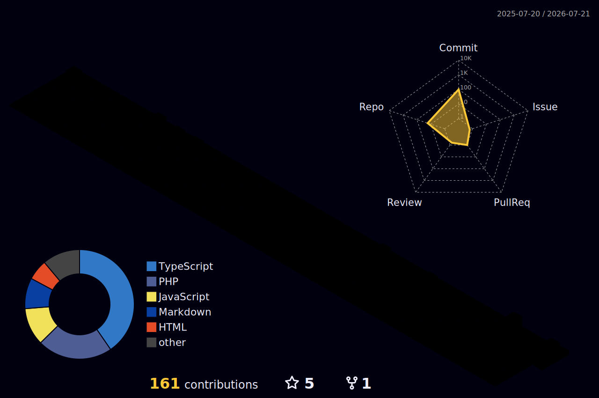

<!-- HEADER BANNER -->

  

<!-- TYPING ANIMATION -->

  

  A passionate software engineer crafting immersive 3D web experiences, designing robust database architectures, and engineering high-performance digital solutions.

  

## 🚀 About Me

I build experiences, not just apps. Based in Indonesia, my journey started at the prestigious **SMK Telkom Malang** where I majored in Software Engineering. For me, web development isn't just about compiling code—it's about combining startup-grade aesthetics with raw, low-latency performance. I bridge the gap between creative design and robust system architecture to make interfaces that feel alive.

As a Full Stack Developer, I specialize in crafting interactive 3D digital environments using **Three.js** and **GSAP**, backed by next-generation framework stacks like **Next.js**, **React**, and **TypeScript**. On the server side, I engineer secure, high-scale database structures using **Supabase** and **Prisma ORM**, maintaining sub-second load times and high uptime.

When I'm not writing clean code, you can find me exploring new WebGL techniques, tinkering with automation workflows via GitHub Actions, or refining interactive interfaces. I thrive in collaborative environments where performance, responsiveness, and clean code are treated as core features, not afterthoughts.

  

## 🌐 Interactive 3D Portfolio

Experience a fully immersive, interactive 3D digital universe featuring glowing particle systems, real-time mouse parallax, and responsive GSAP scroll animations. Built with vanilla Three.js and GreenSock.

  

  

## 🛠️ My Tech Stack

Here are the primary tools, languages, and frameworks that I use to bring ideas to life:

### 🎨 Frontend & Creative Tech

  

### ⚙️ Backend, Databases & Infrastructure

  

  

## 📊 3D Contribution Calendar

A visual representation of my contribution history rendered in an isometric 3D space:

  

  

## 🔥 Featured Project

### [LockIn — Premium Productivity Workspace](https://github.com/alfaazrilomega/lockin)

LockIn is a premium, high-performance workspace designed to combine startup-grade aesthetics with zero-latency task management. It features Notion-like clean dark themes, fluid page transitions, AI-assisted prompt optimization, and strict server-side architecture.

  
  
  

#### 🛠️ Built With:

  
  
  
  
  
  

  

  

## 📊 GitHub Analytics

Here is a live summary of my GitHub contributions, repository statistics, and language usage:

<table border="0" align="center" width="100%">
  <tr>
    <td width="50%" align="center">
      
    </td>
    <td width="50%" align="center">
      
    </td>
  </tr>
  <tr>
    <td width="50%" align="center">
      
    </td>
    <td width="50%" align="center">
      
    </td>
  </tr>
  <tr>
    <td colspan="2" align="center">
       
      
    </td>
  </tr>
</table>

  

## 🐍 Contribution Snake

My daily contribution grid mapped out as an animated retro snake game:

  

  

## 📬 Let's Connect!

I am always open to discussing new projects, creative ideas, or opportunities in the web development ecosystem. Feel free to reach out to me via any of the channels below:

  
  
  
  

 

  <i>Designed and engineered with passion by Bernald. Built with Next.js, automated by GitHub Actions.</i>

